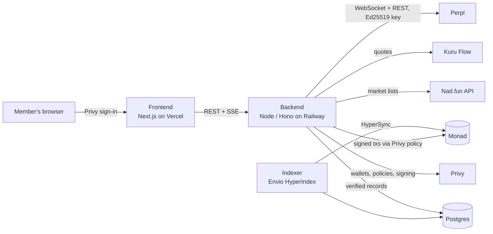

# Cult

**Trade together on Monad.** Cult is social trading for small groups ("cults").
Members trade perps on **Perpl** and Monad-native memes on **Nad.fun** from their own
wallets. Anyone in a cult can switch on **Auto-follow**, and every trade a cult-mate
makes is copied into their own account, sized to their own balance and limits. Every
member's track record is **verified from the chain**, not typed in.

- **App:** https://cult-trades.vercel.app
- **API:** https://cult-production-e803.up.railway.app (`GET /v1/health`)
- **API contract:** [`CONTRACTS.md`](CONTRACTS.md)

Money is always shown in dollars. Under the hood everything settles in AUSD
(Agora's dollar stablecoin, 1:1 with USD). The word "AUSD" only appears on the
funding screen.

---

## How it works

1. **Sign in** with Google or a wallet. Privy creates an embedded wallet the member
   owns.
2. **You land in Global,** the chat and leaderboard everyone is in. Pick your
   country and you're also in its room.
3. **Join or create a cult.**
   - Private cults are joined with a six-letter code like `ABC-DEF`.
   - Public cults can be discovered and joined in one tap.
   - Joining is just joining the group chat; nothing touches your money.
4. **The cult chat is also its activity feed.** Members talk, and trades post
   themselves:
   - "opened BTC-PERP long 5x"
   - "sold 50% of $MOE"
   - "closed …"
5. **Turn on Auto-follow** to copy a cult's trades.
   - You sign your limits once: max $ per trade, and max % of your balance.
   - That signature is the consent. You're never asked per trade.
6. **When a cult-mate trades:**
   - every follower gets a pending copy, with a **20-second window to skip it**;
   - the copy is sized from the follower's own balance and caps;
   - it's placed from the follower's own account.
7. **Copies track their leader.**
   - When the leader **adds**, copies add the same share after the skip window.
   - When the leader **sells part**, copies sell the same share at once.
   - When the leader **exits**, copies exit.
8. **Track records** (win rate, PnL, streak, average win) come from an on-chain
   indexer, and count **your own trades only**; copies are shown apart. They feed:
   - member profiles;
   - leaderboards (Global, per country, per cult, and public cults ranked);
   - the home feed of the week's best trades;
   - shareable trade cards.

---

## What's integrated

| | What it does in Cult |
|---|---|
| **Monad** | The chain. Testnet (10143) today; the mainnet (143) addresses are wired and checked. |
| **Perpl** | Perpetuals. Each member enrolls a delegated **Ed25519 API key**; the owner signs the EIP-712 enrollment in the browser. The backend places orders over Perpl's trading WebSocket with that key. The key can trade but never withdraw. TP/SL are real Perpl trigger orders. |
| **Nad.fun** | Memes. Buys and sells go through the v2 router (`buyWithNative` / `sellToNative`) from the member's own wallet. Leaders' meme trades are detected from the router's `Buy`/`Sell` logs. |
| **Kuru Flow** | Swaps. It funds accounts with "pay with USDC", swapping USDC→AUSD. It also lets memes be **paid in dollars**: AUSD→MON before a buy and MON→AUSD after a sell. On mainnet it routes through a deep AUSD/USDC pool. |
| **Privy** | Sign-in (Google + wallets), embedded wallets, and the **policy engine**. The backend is an *additional signer* on each member's wallet, scoped by a per-member policy (see Safety). |
| **Envio HyperIndex** | The indexer behind verified records. It reads Perpl position and fill events and Nad.fun router events per wallet, and builds round trips, win rate, realized PnL and trade history. |
| **Alchemy** | RPC for on-chain reads and writes (falls back to the public Monad RPC). |
| **Vercel / Railway** | The frontend on Vercel. The backend on Railway: long-running, with a persistent disk. |

---

## Safety model

Cult never takes custody, and the backend can never move a member's money anywhere
but back into that member's own positions.

- **Privy policy:** each member's wallet lets the backend signer do only this:
  - approve and deposit AUSD into their own Perpl account, capped;
  - buy on Nad.fun, capped per buy, with tokens delivered to the member;
  - sell on Nad.fun, with proceeds to the member;
  - approve tokens to the Nad.fun router;
  - swap AUSD↔MON on Kuru Flow, capped, with zero fees and output to the member.

  Everything else is refused **by Privy, before anything is signed**: withdrawals,
  transfers out, swaps routed to someone else, account creation, and key enrollment.
  This was proven with 24 refusals and 9 allows against real Privy.
- **Perpl keys** can trade but can't withdraw. Their secrets are sealed at rest
  (AES-256-GCM).
- **Consent is signed.** Auto-follow limits are a `personal_sign` message that
  spells out what will happen, and the signed text is stored.
- **Feedback loops are impossible.** Every order or tx the engine sends is tagged
  before it leaves, so a copy is never mistaken for a new leader trade.
- **Retries never double a position.** A copy is only retried if nothing reached
  the venue.
- **Crash-safe.** After a restart, anything caught mid-send is settled from what
  actually landed on-chain (receipts, or Perpl order history), and an exit is never
  sold twice.
- **Gas reserve.** The last 0.25 MON is never spent, so a member can always exit.
- **Rate limits:** per member, per IP, and stricter on order routes. A
  `npm run preflight` check guards every deploy.

---

## Architecture



```
/frontend   Next.js app (Vercel). Talks only to the backend API.
/backend    Node + Hono + SQLite. Copy-trading engine, venue adapters, Privy signer,
            funding, chats, leaderboards, API + live updates (SSE). See backend/README.md
/indexer    Envio HyperIndex project: verified per-wallet stats. See indexer/README.md
CONTRACTS.md  The API contract between the three.
```

**The backend in one breath:**
- One `VenueAdapter` interface covers Perpl and Nad.fun.
- The copy engine (`backend/src/mirror`) detects leader trades: from Perpl's
  WebSocket, or from Nad.fun router logs.
- It schedules copies with a skip window, sizes them from each follower's balance
  and caps, and places them through the adapter.
- It follows adds, partial sells and exits.
- Manual "stack on this trade" is a separate code path.
- Chats, notices, leaderboards, the home feed and profiles live in
  `backend/src/api`.

---

## Run it locally

You need Node 24 (the backend also runs on 22.5+) and a Monad testnet RPC (the
public one works).

```bash
# backend: http://localhost:8787
cd backend && npm ci
cp .env.example .env         # fill in Privy + key-sealing secret, see backend/README.md
npm run preflight            # checks every setting and outside service
npm run start:dev

# frontend: http://localhost:3000
cd frontend && npm ci
cp .env.local.example .env.local   # NEXT_PUBLIC_CULT_API_BASE_URL=http://localhost:8787
npm run dev

# indexer (optional locally: members show as "unverified" without it)
cd indexer && npm ci
# needs a Postgres; see indexer/README.md "Without Docker"
ENVIO_HASURA=false ENVIO_PG_HOST=... ENVIO_API_TOKEN=... npx envio start
```

Point the backend at the indexer with `INDEXER_PG_URL` (read-only user) or
`INDEXER_GRAPHQL_URL`.

## Deploy

- **Frontend:** a Vercel project with Root Directory `frontend`, building from
  `main`. It needs `NEXT_PUBLIC_CULT_API_BASE_URL`, `NEXT_PUBLIC_PRIVY_APP_ID` and
  `NEXT_PUBLIC_MONAD_CHAIN_ID`.
- **Backend:** Railway.
  - Root `/backend`, config file `/backend/railway.json`, which holds build, start,
    the pre-deploy preflight, health check and restart policy.
  - A volume at `/data`, with `DB_PATH=/data/cult.db`.
  - **One replica.**
- **Indexer:** Railway, in the same project: a Postgres plus a service with root
  `/indexer`, config file `/indexer/railway.json`, `ENVIO_HASURA=false`,
  `ENVIO_PG_*` taken from the Postgres, and `ENVIO_API_TOKEN`. Then give the backend
  `INDEXER_PG_URL`.
  - For mainnet, start it with `--config config.mainnet.yaml`.

---

## What's been verified

Every "passed" has real transactions or a reproducible check behind it; the tx
hashes are in the commit messages.

| Check | Status |
|---|---|
| Perpl markets and request signing | ✅ against the live servers |
| Nad.fun buy and sell, signed by Privy under a member's policy | ✅ testnet; an over-cap buy was refused by Privy with nothing broadcast |
| Privy policy: what the backend may and may not sign | ✅ 24 refused / 9 allowed, real Privy |
| Copy trading on Nad.fun through real Privy wallets | ✅ testnet: leader buys, sells half, adds, exits. Both followers copy each step, balances equal to the wei |
| Crash recovery reading real fills back from the chain | ✅ testnet txs |
| Indexer vs an independent decoder (Nad.fun) | ✅ equal to the wei, including partial sells and adds |
| Indexer handler rules (Perpl averaged entry, funding, fills; Nad.fun average cost) | ✅ simulated events |
| Kuru Flow USDC→AUSD and "memes paid in $" | 🟡 simulated on mainnet with real routes (`eth_call`); no real swap yet |
| Perpl orders through a delegated key, TP/SL, Perpl copy trading, indexer Perpl check | ⏳ built; needs a funded Perpl account to run |

**Tests:** the backend has 76 unit tests plus an API smoke test that covers every
route, including the refusals. The indexer has handler tests on simulated events.
